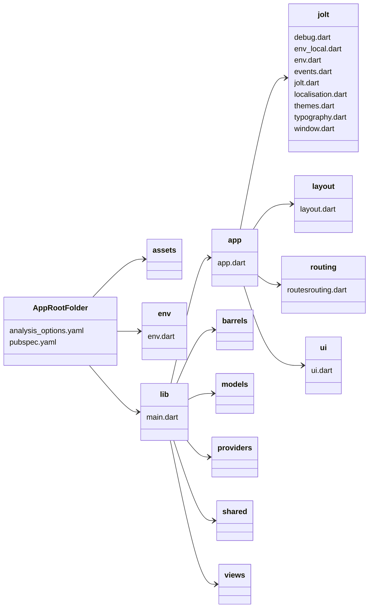

# Project Structure

## Outline

Heres a quick outline of a Jolt app structure:




- AppRootFolder
     - pubspec.yaml
     - analysis_options.yaml
     - **env**
          - env.dart
     - **assets**
          - {assets go here}
     - **lib**
          - main.dart {the starting point for the app, you will want to initialse Jolt within this file}
          - **app**
               - {app config, logic and views go here}
          - **barrels**
               - {proxies that export various dependency files go here}
          - **models**
               - {models that are used within the application go here}
          - **providers**
          - **shared**
          - **views**

```
app
│   pubspec.yaml
│   analysis_options.yaml
|
└─── env/
|    │   
|    └─── env.dart
|
└─── assets/
│
└─── lib
     │   
     └─── main.dart
     |
     └─── app/
     │
     └─── barrels/
     │
     └─── models/
     │
     └─── providers/
     │
     └─── shared/
     │
     └─── views/
```

Next we will break down each component.

---

### pubspec.yaml

Here you can update:

- The current app version
- Currently installed packages
- Any assets to be used within the app

---

### analysis_options.yaml

Your project comes with [**flutter_lints**](https://pub.dev/packages/flutter_lints) setup by default.

By editing the `analysis_options.yaml` of your app, you can create overrides for specific linting rules.

---

### Env Folder

This folder will contain subfolders for each of your different environments. Such as local, dev, staging and live.

Read more about environment set up and switching [**here**](../workflow/new-project#environments).

---

### Assets Folder

This folder will contain all of your assets, it's recommended to group your assets by file type

---

### main.dart

The `main.dart`, located inside the `lib` folder, is the starting point for your app.

This file will contain a `main()` function, which will run your Jolt app.

Any settings for your Jolt app can be found here, though it's recommended to keep your settings organised in a project folder.

---

### App Folder

This folder will files that pertain to the settings of your Jolt app. Such as:

- Themes
- Typography
- Constants
- Navigation
- Widget settings

If you edit the values in the files, then refresh your app, you will see the changes reflected.

---

### Shared Folder

This folder is a place to store any widgets that might be shared across your app. If a custom shared widget/feature needs multiple files, organise them in a folder, such as `/drawing_box`.

---

### Models Folder

This folder will store all the models for your app, that represent data in the database.

Models should be further organised by feature, such as:

    models
    |
    └─── auth
    |    └─── user_model.dart
    |    └─── team_model.dart
    |
    └─── chat
         └─── chat_model.dart
         └─── message_model.dart

Models should be used by providers when fetching and updating data.

---

### Providers Folder

This folder will store all the providers/services for your app.

They will use models to fetch and update data from the database, based on user actions in the views.

Providers should also be grouped by feature like so:

    providers
    |
    └─── auth
    |    └─── user_provider.dart
    |    └─── team_provider.dart
    |
    └─── chat
         └─── chat_provider.dart

---

### lib/views Folder

This folder will store the different views/screens/pages of your app.

Each view should be a feature of your app and have its own folder.

Each view can have a main view widget and a view controller. Plus any other widgets that are components needed for just that view.

It might look something like this:

    views
    |
    └─── login
    |    └─── login_view.dart
    |    └─── login_controller.dart
    |
    └─── home
         └─── home_view.dart
         └─── home_controller.dart
         └─── home_page_1.dart
         └─── home_page_2.dart
         └─── home_page_3.dart
